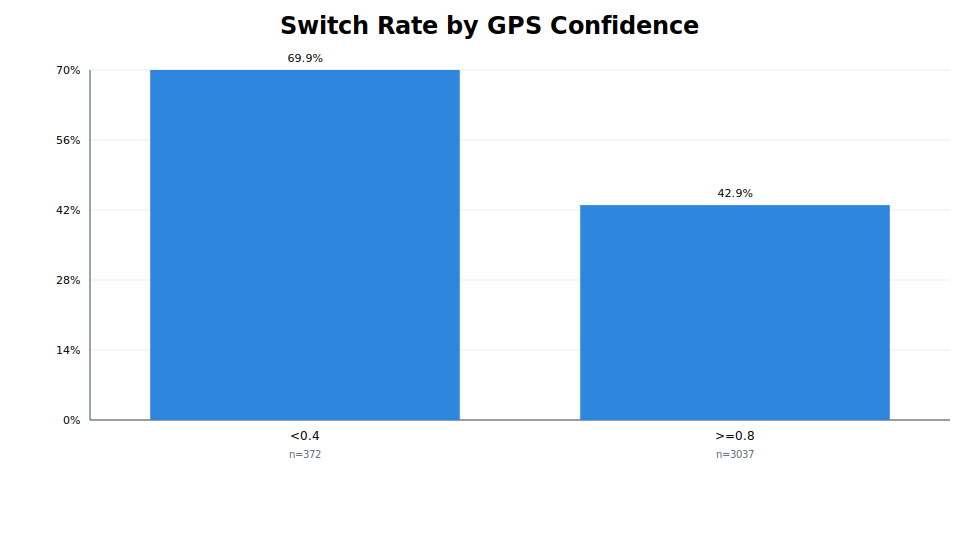
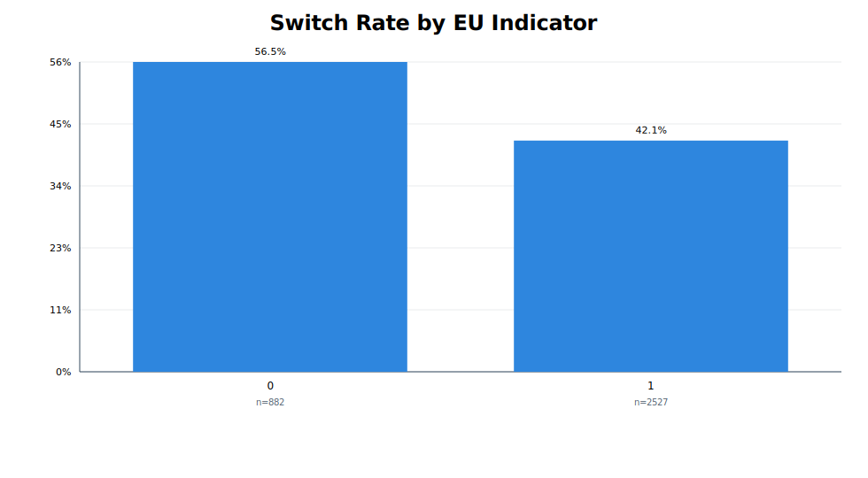
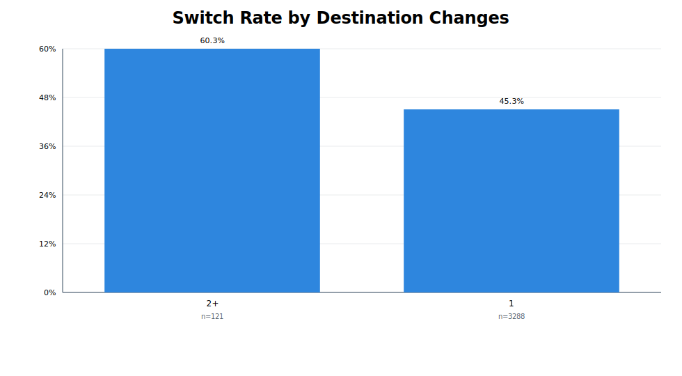
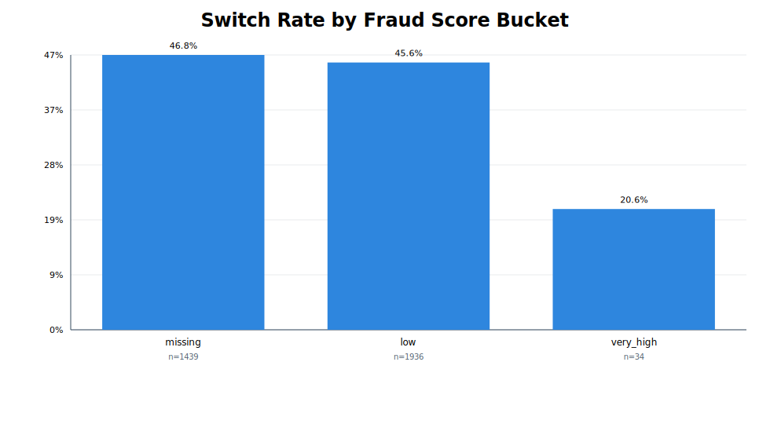

# Taxi Upfront Pricing Precision — Stakeholder Deck

## Slide 1 — Executive Summary
- Current switch rate is high and creates fare surprise risk.
- Two prioritized levers: GPS fallback and underprediction correction.
- Expected combined impact: meaningful switch-rate reduction with manageable implementation risk.

## Slide 2 — Why this matters
- Upfront-to-metered switches reduce trust and increase support load.
- Pricing precision is a core product-quality metric.

## Slide 3 — KPI definition
- `relative_error = |metered - upfront| / upfront`
- `is_switched = 1(relative_error > 0.20)`
- Primary KPI: `% switched rides`

## Slide 4 — Error concentration by GPS confidence

## Slide 5 — Regional and destination-change effects

## Slide 6 — Fraud-risk and behavioral segmentation

## Slide 7 — Root cause insights
- Switched rides show systematic underprediction bias in distance and duration.
- Risk clusters: low GPS confidence, certain regions, destination changes.

## Slide 8 — Business Research Part 2: execution plan
- 3-arm A/B/n with guardrails and phased rollout.
- Explicit rollback and scale criteria.

## Slide 9 — Recommendation
1. Ship GPS fallback in high-risk buckets first.
2. Layer dynamic uplift using bias-risk model.
3. Instrument daily monitoring and weekly recalibration.

## Slide 10 — Decision request
- Approve pilot launch in next sprint.
- Confirm ownership across pricing, DS, and ops.
